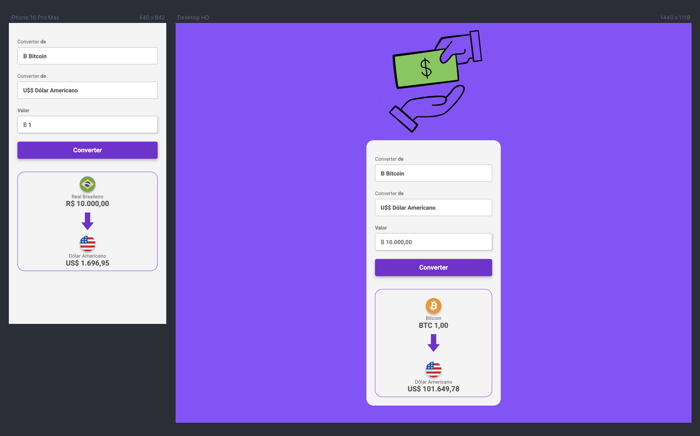

# Challenge 03: Convert Money

A simple **responsive currency conversion website** built with Vanilla JavaScript. This tool fetches
daily exchange rates from a currency API to provide accurate conversions between various currencies.

## 📸 Screenshots

## 🔗 Links

&nbsp;&nbsp;

## 👷🏻‍♀️ Built with

- HTML
- CSS
- JS

### 🚀Features

- Semantic HTML
- Reset CSS
- Media Queries
- Fetch API

## 👩🏻‍💻 Author

&nbsp;&nbsp;
&nbsp;&nbsp;

